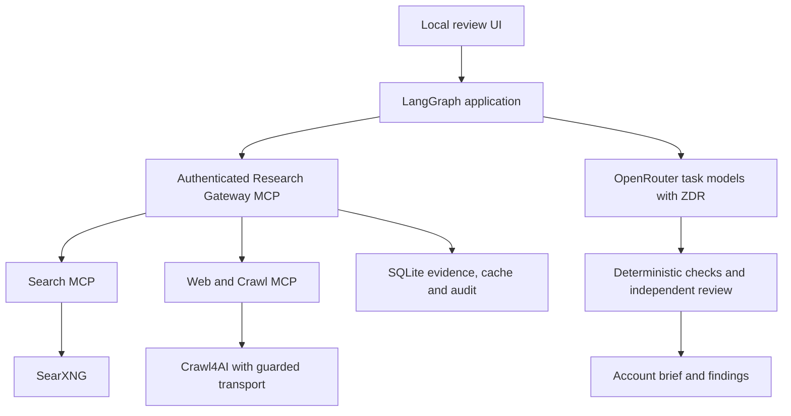

# Research architecture

The existing FastAPI/React application and LangGraph graph remain in `src/customer_intelligence` and `web`. The new `research_stack` package separates schemas, policy-aware clients, gateway, search and crawling. Docker infrastructure lives in `services`. A wholesale move into multiple Python projects would add packaging work without creating another useful boundary for this single-user release.

Search produces discovery leads. It does not prove company claims. Crawling retrieves evidence from selected public pages and preserves a content hash, source URL/domain, retrieval time, extraction method and request ID. Search query/rank are added when known. First-party status records a relationship to the target domain, not a guarantee of accuracy. Other sources remain `unknown`; the system does not invent reputation ratings.

The application uses only the gateway MCP endpoint. The gateway exposes an explicit tool allowlist, validates arguments and URLs, enforces quotas, filters responses, checks evidence hashes and adds audit records. The search service exposes only `search_web` and `search_news`. The crawl service exposes only `fetch_page`, `crawl_site` and `extract_structured`. All three also provide authenticated readiness through `research_health`. There are no admin, shell, arbitrary JavaScript, browser-profile, credential or outreach tools.

Crawl4AI owns browser ingestion, markdown generation and CSS-based structured extraction. Every browser request is fulfilled through the existing policy-aware HTTPX transport, which resolves and pins public IP addresses and checks every redirect and robots policy. Unintercepted Chromium requests encounter a closed proxy. Each fetch uses a disposable browser, without user cookies, downloads, form submissions or WebSocket access. It supports public HTML pages; upload a permitted text copy when a page requires login, human verification, unsupported media or an interactive workflow.

The graph reviews supplied notes, discovers accounts, selects first-party URLs, fetches evidence, checks gaps, performs bounded targeted follow-up search, drafts briefs and independently verifies them. Gap output is constrained to named categories. Search terms are built from the public customer profile and fixed vocabulary, never copied from instructions in retrieved pages or private interviews. Missing timing can remain missing. Imported evidence is still available if web retrieval is incomplete; failed pages are recorded individually.

Each account has a maximum of five model calls by default: one gap check and at most two drafting/review pairs. The application counts recorded calls across resumes. If service errors consume the allowance, a run pauses and the user may raise its limit. Per-run query/page quotas persist in the gateway database and cannot be reset by resuming. Each crawl also has a maximum of 20 pages, depth 3 and 120 seconds. The graph recursion limit remains finite.

The three independently editable model roles, ZDR enforcement, provider-enforced schemas for research/review, 4,096/8,192/16,384 output limits and shared $5 model budget remain. No search-provider credits or key are required. A `ResearchProvider` protocol and functional `NullPaidResearchProvider` establish the optional escalation boundary. Exa/Parallel are not connected or invoked in this release.

Findings retain `observed_fact`, `supported_inference` or `hypothesis` with evidence IDs. The brief's corresponding labels are fact, inference and hypothesis. Confidence on saved findings is unset unless provided; classification is not converted into a fabricated probability. The model's evidence-gap confidence is explicitly a model judgement and is not the success metric.

SQLite is sufficient for one local user. Application state/checkpoints and gateway evidence/cache/audit use separate persistent volumes. Redis and Postgres are unnecessary. Cache keys include policy settings, so permitted material is not reused across incompatible policies. Cached evidence keeps its original retrieval timestamp and request provenance, with the current call ID in the response envelope. Search TTL is 15 minutes, page/extraction TTL six hours, capped at one day; expiry never deletes evidence already retained for a recommendation.

## Assumptions and conflicts resolved

- Preserve the approved three-model setup, mandatory review and existing account brief/UI instead of replacing them with the attachment's illustrative two-model configuration or alternative brief shape.
- Keep the original Mac UI at port 8765. The optional full Docker application uses 8766 with a separate database. Both can use the gateway on 8767.
- Keep macOS Keychain for native operation. The Docker UI supports a private, mode-0600 credential file or an environment-supplied OpenRouter key; containers cannot use the Mac login Keychain.
- Limits default to 60 searches and 80 pages across a shortlist run, up to three search rounds and five model calls per account. The brief's 15-query/30-page example can be selected in Settings.
- Static scoped credentials are generated locally into separate volumes. They are not internet-facing OAuth credentials; rotation and limitations are in operations.md.
- No Ultra13 testing or certification is claimed. The deterministic fixtures provide a starting point for a separately authorised review.
